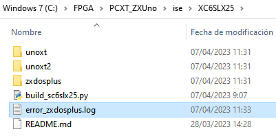

# BUILD XC6SLX25

From this section it is possible to generate the core binaries for all XC6SLX25 based models, updating the resulting files in the releases directory. Any errors occurring during the process will be logged in an error file, example:

## Error Log

If you open the contents, you can see the reason for the error, example:

""Error running xst, open the ISE project and synthesise from there for review.""
